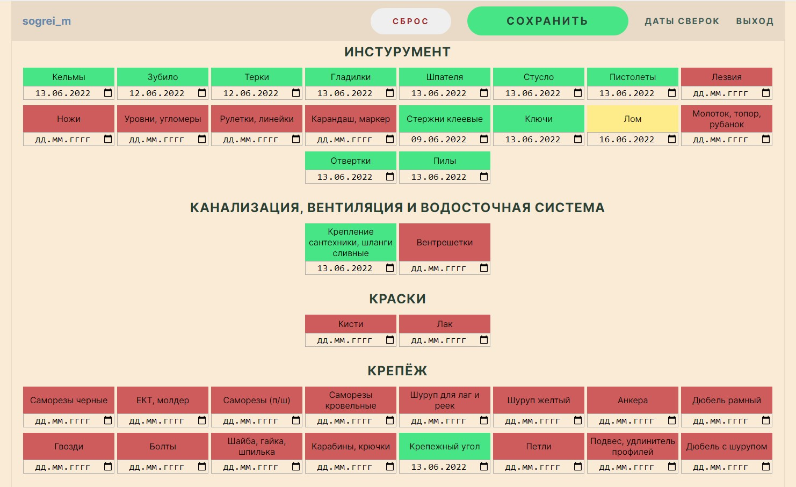

```Python 3.10```
## Сверка товаров для магазина строительных материалов *"Согрей-М" (г.Гродно)*

Сайт помогает вести учёт сверки товаров. 
Удобная подсветка ячеек позволяет выделять товар, который необходимо сверить в текущем месяце.

**Полезные функции**
1. Внесение изменений в категории товара (создание, изменение, удаление)
2. Просмотр истории сверок в разрезе каждого товара

